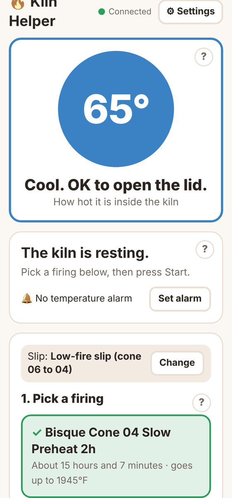
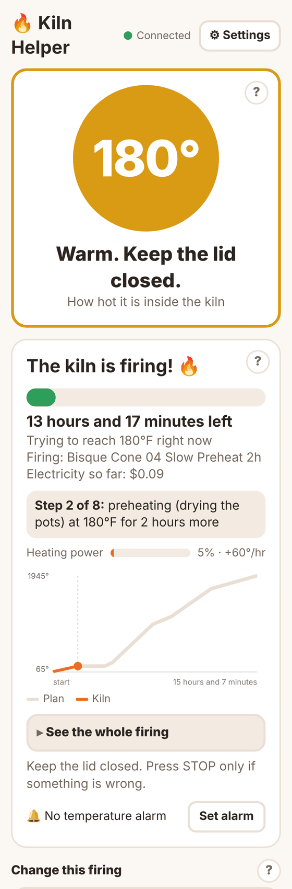
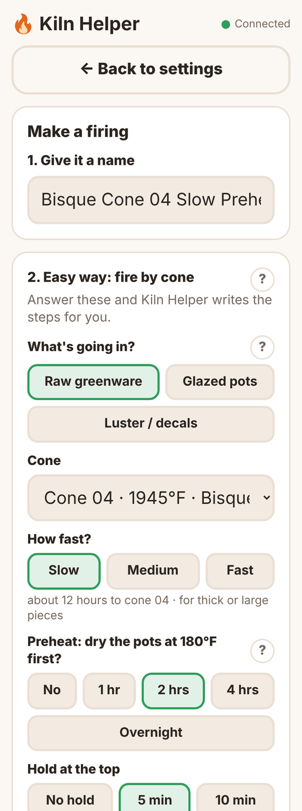

# 🔥 Kiln Helper

**Turn a manual kiln (the kind with a kiln sitter and dial switches) into an automatic one with a Raspberry Pi, using a screen simple enough for a kid to read.**

Kiln Helper is free, open-source software for slip casters, potters and ceramic hobbyists. It runs on a Raspberry Pi in a small controller box. You plug the kiln into the box, turn its dials up to High, leave the kiln sitter in as a backup, pick a firing on a touchscreen or your phone, and press Start. Nothing inside the kiln is rewired. It's designed for single-phase, single-zone **120 V or 240 V** kilns up to 30 A: check **[Will my kiln work?](docs/compatibility.md)** first.

It's built on top of the proven [kiln-controller](https://github.com/jbruce12000/kiln-controller) engine by jbruce12000 and adds a friendly screen, phone alerts, automatic safety shutoffs, and the features you'd expect from a store-bought controller like a Skutt. **You only download Kiln Helper:** its installer sets up kiln-controller for you.

<p>
  
  
  
</p>

> ⚠️ **Safety first.** A kiln runs on 120–240 V and gets hotter than 1,800°F. This project involves mains wiring that can kill you or start a fire if done wrong. **Have a licensed electrician build or check the power side.** Never leave out the contactor, the separate high-limit controller, or the E-stop, and never remove or bypass the kiln's own Kiln Sitter, timer or fuses. Never leave early firings unattended. Kiln Helper is **not certified safety equipment** and comes with **no warranty** (see [LICENSE](LICENSE)). Read [Safety and testing](docs/safety-and-testing.md).

---

## What it does

**Easy to use**
- A big color temperature circle (blue = cool, red = very hot) with plain words like *"HOT! Don't touch the kiln."*
- Pick your slip once (low-fire, mid-fire or high-fire) and only the right firings show
- A safety checklist before every start, which tells you **which cone to put in the kiln sitter** and **how long to set its timer** for that firing
- Guided setup the first time, plus a **?** help button on every section
- Works on the Pi's 7" touchscreen and on any phone on your Wi-Fi

**Firing like a Skutt**
- **Fire by cone:** say what's going in (greenware, glazed pots, luster), pick the cone and Slow, Medium or Fast. Medium uses the same segments Skutt publishes for its Cone Fire mode.
- **Preheat** (candling), **Hold** and **Slow cool**
- A **Library** of ready-made low-fire firings: bisque, glaze, luster, decals, and drop-and-hold
- **Delay start** ("start in 6 hours"), **temperature alarm**, and **firing cost**
- **During a firing:** live graph, the current step, heating power, *Add 30 minutes to this hold*, and *Skip to the next step*
- **Pretend firing:** watch a whole firing play out in seconds before you run it
- **History** of the last 10 firings with graphs, cost, and a note on how your witness cones looked, downloadable as a spreadsheet file

**Safety**
- **Automatic shutoff** on serious problems, with error codes E1–E8 (not heating, too hot, bad or stuck thermocouple, lost contact, no power to the elements)
- **Checked STOP:** every stop is confirmed. If it isn't, the safety relay cuts all power, or the screen tells you plainly to use the E-stop
- **Stuck-relay alarm:** cuts all power with the safety relay if the kiln heats up while it should be off
- **Grown-up PIN** and a **maximum temperature lock**, enforced on the Pi for every way of heating. STOP never needs the PIN.
- Watches the controller box temperature

**Phone alerts** (free, through the [ntfy](https://ntfy.sh) app): firing started, done, cool enough to open, alarms and problems.

## How it works

The Pi reads the kiln temperature from a thermocouple and switches the elements on and off through a solid-state relay to follow the firing plan. Kiln Helper is the only part phones talk to, and it checks the PIN and temperature limits before anything heats. A contactor, a separate high-limit controller and an E-stop can cut all power on their own, whatever the Pi does.


## Get started

1. **[Will my kiln work?](docs/compatibility.md):** volts, amps, dials, Kiln Sitter, and what must stay
2. **[Parts list](docs/parts-list.md):** everything to buy, with links (about $350–450)
3. **[Wiring](docs/wiring.md):** diagrams for the low-voltage side and the mains side
4. **[Build guide](docs/build-guide.md):** step by step, from bench test to first firing
5. **[Install the software](docs/install.md):** one command on the Raspberry Pi
6. **[Using Kiln Helper](docs/using-it.md):** firings, preheat, hold, cones, alarms
7. **[Troubleshooting and error codes](docs/troubleshooting.md)**
8. **[Watching from outside the house](docs/remote-access.md)** (optional)
9. **[Safety and testing](docs/safety-and-testing.md):** how the protections work, the automatic tests, and the checks a qualified person must do

Quick install on a Raspberry Pi 4 running Raspberry Pi OS (Bookworm):

```bash
git clone https://github.com/christeferrains/kiln-helper.git
cd kiln-helper
./install.sh            # practice mode: nothing is switched yet
```
That one command also downloads and sets up kiln-controller. There's nothing else to download.

Then open **http://kiln.local:8081** on your phone.

## What's in this project

```
README.md            this page
install.sh           one-command installer for the Raspberry Pi (also installs kiln-controller)
software/
  index.html         the Kiln Helper screen
  kiln_helper.py     the Kiln Helper service: the only thing on the network; PIN and limits,
                     checked STOP, auto-shutoff, alerts, delay start, history
  kiln-helper.json   settings template (phone alert name, optional safety relay and sensor)
tests/               automatic tests with simulated hardware (see docs/safety-and-testing.md)
docs/                the guides and pictures
LICENSE              GNU GPL v3
```

## Share and help

This project exists to bring the slip-casting and kiln community together.
- Found a problem or have an idea? Open an **[Issue](https://github.com/christeferrains/kiln-helper/issues)**.
- Built one? Share photos and your favorite firings in **[Discussions](https://github.com/christeferrains/kiln-helper/discussions)**.
- Improvements are welcome as pull requests.

## Credits

- **[kiln-controller](https://github.com/jbruce12000/kiln-controller)** by jbruce12000 and contributors (GPL v3): the temperature control engine Kiln Helper runs on. The installer changes one line so it only listens on the Pi itself
- **[kiln-profiles](https://github.com/jbruce12000/kiln-profiles)** (GPL v3): community firings included in the Library, credited in the app
- Cone temperatures: Orton self-supporting cone chart (108°F/hr), as published by [New Mexico Clay](https://nmclay.com/informational-pages/orton-cone-chart-in-farenheight) and [KilnSchedule](https://kilnschedule.com/orton-cone-chart/)
- Cone Fire segment shape and preheat rate: Skutt's published KilnMaster programming manual

Kiln Helper is an independent community project. It is not made by, endorsed by, or affiliated with Skutt, Paragon, Orton, Bartlett or any kiln maker.

## License

Free software under the **GNU General Public License v3**, the same license as kiln-controller. You may use, share, change and even sell it, as long as you keep it open under the same license. There is **no warranty**. See [LICENSE](LICENSE).
