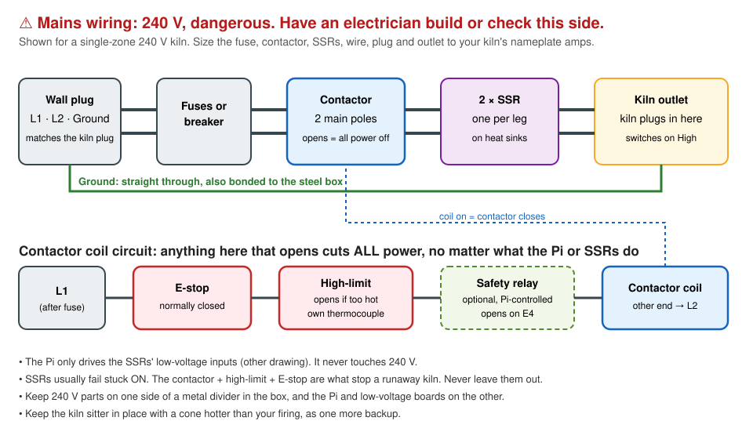

# Wiring

[← Parts list](parts-list.md) · Next: [Build guide →](build-guide.md)

There are two separate sides. Keep them apart in the box, ideally with a metal divider between them.

1. **The low-voltage side:** the Raspberry Pi and small boards, 3.3 V and 5 V only. Safe to work on.
2. **The mains side:** 240 V to the kiln. **Dangerous. Have a licensed electrician build or check it.**

Always unplug everything before touching any wiring.

## 1. Low-voltage side


### Thermocouple board (MAX31856)

| MAX31856 pin | Raspberry Pi pin | Notes |
| --- | --- | --- |
| VIN | Pin 1 (3.3 V) | |
| GND | Pin 6 (GND) | |
| SCK | Pin 11 (GPIO 17) | clock |
| SDO | Pin 13 (GPIO 27) | data to the Pi |
| CS | Pin 15 (GPIO 22) | chip select |
| SDI | Pin 19 (GPIO 10) | data from the Pi (the MAX31856 needs this one) |
| T+ / T− | thermocouple | In the US, type K **yellow is +** and **red is −** |

These are kiln-controller's default pins in `config.py`, so nothing needs changing. The installer switches kiln-controller from the MAX31855 board to the MAX31856.

### SSR driver

A Pi pin can't give the SSRs enough current on its own (about 16 mA), so a small transistor does the switching:

| From | To |
| --- | --- |
| Pin 16 (GPIO 23) | 1 kΩ resistor → 2N2222 **base** (middle leg) |
| 2N2222 **emitter** | GND (pin 20) |
| 2N2222 **collector** | SSR input **(−)** on both SSRs |
| Pin 2 (5 V) | SSR input **(+)** on both SSRs |

The two SSR inputs are wired side by side (in parallel). Check your transistor's pin order, because it varies by maker.

### Optional: relay board (safety relay and vent)

| Relay board | Raspberry Pi |
| --- | --- |
| VCC | Pin 4 (5 V) |
| GND | any GND |
| IN1: **safety relay** | Pin 18 (GPIO 24) |
| IN2: **vent fan** | Pin 22 (GPIO 25) |

Then add them to `~/kiln-controller/public/alerts.json`:
```json
"safety_relay_pin": 24,
"vent_relay_pin": 25
```
Most of these boards switch on when the pin goes LOW ("active-low"), and that's what Kiln Helper expects. If yours clicks **on** when it should be off, add `"relays_active_low": false`.

### Optional: power sensor

| ADS1115 | Raspberry Pi |
| --- | --- |
| VDD | Pin 17 (3.3 V) |
| GND | any GND |
| SDA | Pin 3 (GPIO 2) |
| SCL | Pin 5 (GPIO 3) |
| A0 | the clamp sensor's signal |

The clamp's output swings above and below zero, so **bias** its other lead to the middle of 3.3 V with two 10 kΩ resistors (3.3 V → 10 kΩ → midpoint → 10 kΩ → GND) and a 10 µF capacitor from the midpoint to GND. Clip the clamp around **one** kiln supply wire, never around the whole cord. Then add to `alerts.json`:
```json
"amp_sensor": {"channel": 0, "amps_per_volt": 30}
```

## 2. Mains side: electrician



**Power path:** wall plug → fuses or breaker → contactor (both poles) → one SSR per leg → kiln outlet. Ground goes straight through and is bonded to the steel box.

**Contactor coil circuit:** L1 → E-stop (normally closed) → high-limit relay (opens when too hot) → *optional* safety relay (closed while the Pi says it's OK) → contactor coil → L2. If **anything** in that chain opens, the contactor drops and the kiln loses all power.

Rules:
- Size the wire, plug, outlet, fuses, contactor and SSRs to the kiln's nameplate amps
- Mount the SSRs on their heat sinks with the fins outside the box, pointing up
- The high-limit controller uses its **own** thermocouple, separate from the Pi's
- Keep the kiln sitter in place with a cone hotter than your firing as one more backup
- The Pi never touches 240 V. It only drives the SSRs' low-voltage inputs and the relay board

---
[← Parts list](parts-list.md) · Next: [Build guide →](build-guide.md)
